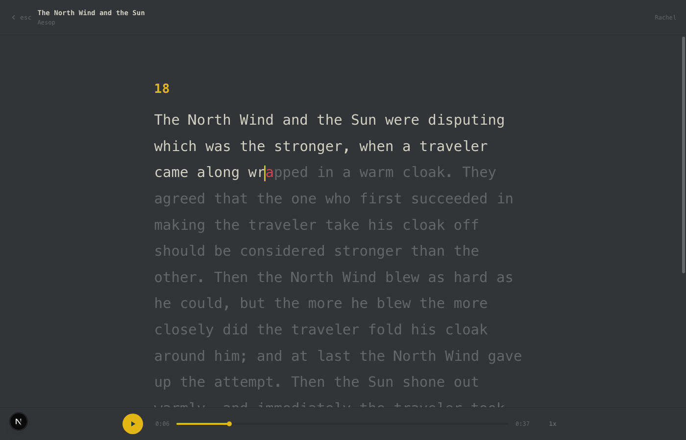
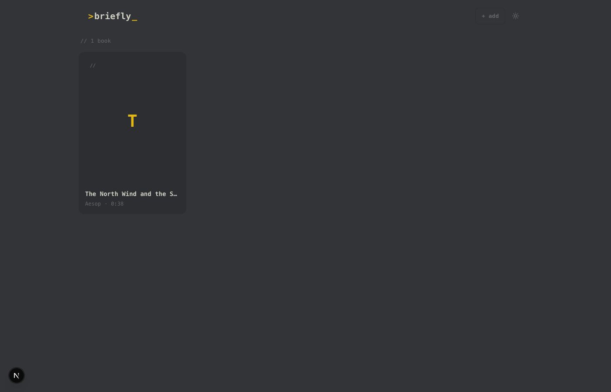
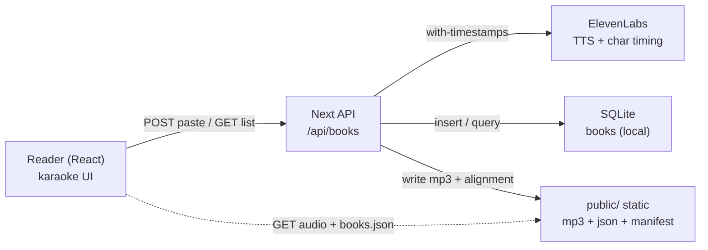
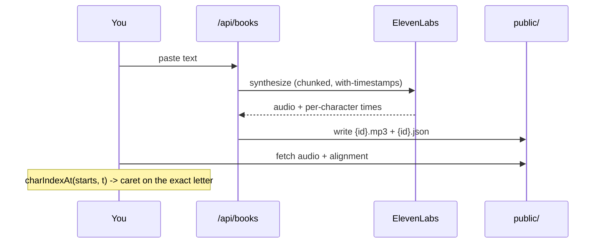

# Briefly

Paste any text, hear it read aloud, and follow along word-by-word - karaoke style, with the caret landing on the exact letter being spoken.



[](LICENSE)


## Contents

- [Features](#features)
- [Why it feels seamless](#why-it-feels-seamless)
- [Architecture](#architecture)
- [How it works](#how-it-works)
- [Tech stack](#tech-stack)
- [Quick start](#quick-start)
- [Configuration](#configuration)
- [Project layout](#project-layout)
- [License](#license)

## Features

- Real voice narration (ElevenLabs), warm and natural
- Per-character karaoke highlight synced to the exact audio moment - not a word-length guess
- Click any word to jump straight to it - scrub by meaning, not seconds
- Adjustable speed (0.75x-2x), light + dark themes, keyboard control (space / esc / arrows)
- Long text is chunked on sentence boundaries and stitched back into one seamless track
- Mobile-first, installable (PWA), deep-linkable books (`/?b=<id>&t=<seconds>`)

## Why it feels seamless

The highlight is driven by **real per-character timestamps** from the text-to-speech
engine, not an estimate. At any playback moment the reader binary-searches the timing
array for the active character, so the caret sits on the exact letter being spoken.



## Architecture

A thin Next.js app: pure logic lives in `lib/` (and is unit-tested), the React reader
lives in `components/`, and the API route synthesizes audio. Audio and per-character
timing are written under `public/` and served as static files, so the deployed app
needs no writable database - it reads a committed `books.json` manifest.



| Module | Role |
| --- | --- |
| `lib/karaoke.ts` | playback-time -> active char/word model (tested) |
| `lib/elevenlabs.ts` | TTS synth, sentence chunking, audio + timing stitch |
| `lib/db.ts` / `lib/manifest.ts` | sqlite schema + static manifest export |
| `lib/auth.ts` | local/LAN or bearer-token write gate |
| `components/Reader.tsx` + `KaraokeText.tsx` | reader UI + memoized highlight |
| `app/api/books` | create (synthesize) + list + delete |

## How it works



## Tech stack

- **Next.js 16** (App Router, Turbopack) + **React 19** + **TypeScript** (strict)
- **Tailwind CSS v4**
- **better-sqlite3** for local storage; a static `public/books.json` manifest for serverless
- **ElevenLabs** `with-timestamps` TTS for audio + character alignment
- **Vitest** + **Testing Library** for unit, integration, and component-render tests

## Quick start

```bash
git clone https://github.com/bunlongheng/briefly.git
cd briefly
npm install
cp .env.example .env.local   # add your ELEVENLABS_API_KEY
npm run dev                  # http://localhost:9877
```

Open the app, click **+ add**, paste your text, pick a voice, and hit **add + narrate**.
Briefly generates the audio + word timing and opens the reader.

## Configuration

| Env var | Default | Purpose |
| --- | --- | --- |
| `ELEVENLABS_API_KEY` | - | required for audio + per-character timing |
| `BRIEFLY_VOICE_ID` | Rachel | default narrator voice id |
| `BRIEFLY_TOKEN` | (empty) | bearer token required for remote `POST /api/books`; empty = local/LAN only |
| `NEXT_PUBLIC_SITE_URL` | Vercel URL | canonical site URL for OpenGraph/metadata |

## Project layout

```
app/
  api/books/        create (synthesize) + list + delete
  layout.tsx        theme set pre-paint, metadata, PWA
  page.tsx          library <-> reader shell
components/
  Reader.tsx        audio + rAF caret + transport
  KaraokeText.tsx   memoized per-paragraph highlight
  Menu.tsx          book grid + empty-state pitch
  AddBook.tsx       paste -> narrate modal
lib/
  karaoke.ts        playback-time -> active char/word (tested)
  elevenlabs.ts     TTS synth + chunk/stitch
  db.ts manifest.ts sqlite + static manifest
  auth.ts           write gate
tests/              vitest: unit + integration + render (28)
```

## License

[MIT](LICENSE) (c) Bunlong Heng

---

<p align="center">
  <sub>Built by <a href="https://bunlongheng.com">Bunlong Heng</a> &middot; <a href="https://bunlongheng.com/projects/briefly">See it in my portfolio &rarr;</a></sub>
</p>
