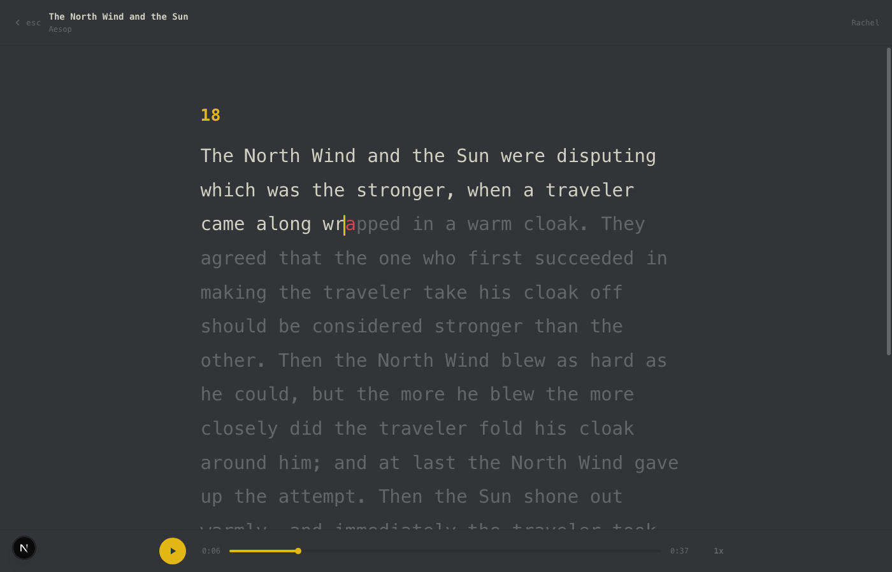

# Briefly

> Paste any text, hear it read aloud, and follow along word-by-word - karaoke style.

Briefly turns any text into a narrated, monkeytype-style read-along. Paste a chapter,
an article, or your own writing; Briefly synthesizes a natural voice and highlights
every word at the exact moment it is spoken - down to the character.



## Why it feels seamless

The karaoke highlight is driven by **real per-character timestamps** from the
text-to-speech engine, not a word-length estimate. At any playback moment the reader
binary-searches the timing array for the active character, so the caret lands on the
exact letter being spoken. Click any word to jump straight to it.

- Real voice narration (ElevenLabs), warm and natural
- Per-character karaoke highlight synced to the audio
- Click-to-seek by word, adjustable speed, light + dark themes
- Long text is chunked on sentence boundaries and stitched back into one seamless track
- Mobile-first, installable (PWA), keyboard-friendly (space / esc / arrows)

## Tech stack

- **Next.js 16** (App Router, Turbopack) + **React 19** + **TypeScript**
- **Tailwind CSS v4**
- **better-sqlite3** for local storage; a static `public/books.json` manifest for serverless
- **ElevenLabs** `with-timestamps` TTS for audio + character alignment
- **Vitest** for unit tests

## Getting started

```bash
npm install
cp .env.example .env.local   # add your ELEVENLABS_API_KEY
npm run dev                  # http://localhost:9877
```

Open the app, click **+ add**, paste your text, pick a voice, and hit **add + narrate**.
Briefly generates the audio + word timing and opens the reader.

### Environment

| Var | Required | Purpose |
| --- | --- | --- |
| `ELEVENLABS_API_KEY` | yes (for audio) | text-to-speech + character timing |
| `BRIEFLY_VOICE_ID` | no | default narrator voice |
| `BRIEFLY_TOKEN` | no | bearer token for remote `POST /api/books` |

## How it works

```
paste text ──▶ POST /api/books ──▶ ElevenLabs (with-timestamps)
                                        │
                    ┌───────────────────┴───────────────────┐
                    ▼                                        ▼
        public/audio/{id}.mp3                    public/audio/{id}.json
        (streamed with Range support)      { text, starts[], ends[] } per char
                    │                                        │
                    └──────────────▶ Reader ◀────────────────┘
                         charIndexAt(starts, t) → active char → caret
```

Audio and alignment are written under `public/` so they are served as static files
with native HTTP Range / 206 support (required by iOS Safari `<audio>`). A committed
`public/books.json` manifest lets the deployed app work without a writable database.

## Scripts

| Script | What it does |
| --- | --- |
| `npm run dev` | dev server on :9877 |
| `npm run build` | production build |
| `npm test` | unit tests (karaoke sync, chunking) |
| `npm run typecheck` | `tsc --noEmit` |
| `npm run export:manifest` | regenerate `public/books.json` from the local DB |

## Deploy

Deploys to Vercel. The app reads the committed `public/books.json` + static audio
on serverless; adding new books is done locally (where the sqlite DB is writable),
then `public/books.json` + `public/audio/*` are committed and pushed.

## License

MIT
